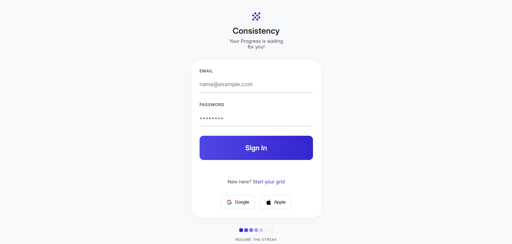
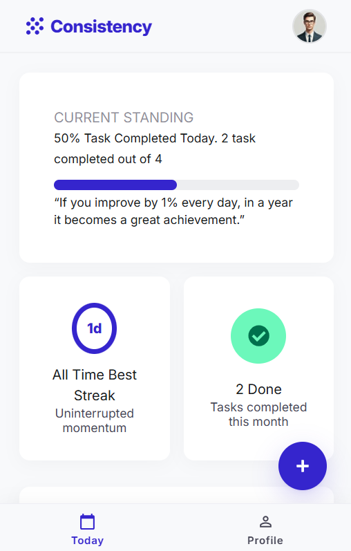

# Consistency

<p align="center">
  <strong>A full-stack habit tracking application designed to make daily consistency visible, measurable, and easier to maintain.</strong>
</p>

<p align="center">
  <a href="https://github.com/Tamilzsurya/consistency-tracker">
    
  </a>
  
  
  
  
  
</p>

---

## 📌 Overview

Consistency is a full-stack habit tracking web application built around one simple idea:

> **Don't just track what you need to do. Understand how consistently you are doing it.**

Traditional to-do applications mainly focus on individual tasks:

```text
☑ Workout
☐ Read
☑ Practice Coding
```

Consistency focuses on the **pattern of those actions over time**.

Habits are represented against calendar dates, allowing users to record their daily progress, identify missed days, track streaks, and understand their consistency over time.

The application is built using:

- React.js
- Node.js
- Express.js
- MySQL

---

# 🎯 Problem

Starting a habit is usually easier than maintaining it consistently.

People often create goals such as:

- Exercise regularly
- Read every day
- Learn programming
- Practice a skill
- Study for an exam
- Work on a personal project
- Maintain a healthier routine

However, users can struggle with:

- Forgetting whether they completed a habit
- Losing track of progress across multiple days
- Not seeing their long-term consistency
- Losing motivation after missing a day
- Using simple to-do lists that focus on individual tasks
- Having no clear visual representation of their habit history
- Finding it difficult to understand whether their consistency is improving

### Core Problem

> **Daily actions are easy to perform, but difficult to understand as a long-term pattern.**

---

# 💡 Solution

Consistency changes the focus from **individual task completion** to **behavior over time**.

Each habit is represented as a row, while calendar dates are represented as columns.

For example:

```text
Habit       01  02  03  04  05  06  07  08
---------------------------------------------
Workout     ✓   ✓   ✕   ✓   ✓   ✓   -   ✓
Reading     ✓   ✕   ✓   ✓   ✓   ✕   -   ✓
Coding      ✓   ✓   ✓   ✓   ✕   ✓   -   ✓
```

This creates a **consistency grid**.

Instead of only seeing:

```text
Workout - Completed
```

users can see the complete pattern:

```text
Workout
✓ ✓ ✓ ✕ ✓ ✓ ✓ ✓
```

This makes it easier to understand:

- Which days a habit was completed
- Which days were missed
- How consistently a habit is being performed
- How long a habit has been maintained
- Where consistency breaks occur

---

# 🚀 Product Value

Consistency is designed around four main areas of value.

## 1. Make progress visible

Daily effort can feel insignificant when viewed individually.

A calendar-based consistency grid gives that effort historical context.

Users can visually understand:

- How often they complete a habit
- Where they missed a habit
- Whether their consistency is improving
- How long they have maintained a habit

The goal is to turn **invisible daily effort into visible progress**.

---

## 2. Reduce tracking friction

Habit tracking should not become another difficult task.

The daily interaction is designed to be simple:

```text
Open application
       ↓
Find habit
       ↓
Mark completed / incomplete
       ↓
Continue with the day
```

The objective is to make recording progress take only a few seconds.

---

## 3. Encourage consistency instead of perfection

Missing one day should not make the entire journey feel unsuccessful.

Consistency follows the idea:

> **Never miss twice.**

The purpose of tracking is not to punish users for missing a day.

It is to make missed days visible and encourage users to continue.

---

## 4. Turn daily records into useful information

Once daily activity is stored, it can be transformed into useful metrics such as:

- Today's completed habits
- Monthly completion count
- Current streak
- Longest streak
- Habit history
- Completion patterns

This changes raw activity data into information that users can understand.

---

# 📊 Problem → Solution

| Problem | Consistency's Approach |
|---|---|
| Forgetting daily progress | Stores completion for each habit and date |
| Losing historical context | Calendar-based habit tracking |
| Difficulty seeing progress | Visual consistency grid |
| Losing motivation | Streak and progress metrics |
| Repeating missed days | Makes missed days visible |
| Too much tracking effort | Simple daily completion interaction |
| No long-term overview | Historical habit records |
| Difficult to understand improvement | Dashboard and progress statistics |

> The application is designed to reduce the friction involved in tracking and understanding habits. Quantitative claims such as "80% reduction" should only be made after measuring the product with real users.

---

# ✨ Features

## 🔐 Authentication

- User registration
- Email validation
- Password validation
- Password hashing using bcrypt
- Email OTP verification
- Login
- JWT-based authentication
- Protected routes
- Google OAuth authentication
- Authentication error handling

---

## 📝 Habit Management

Users can:

- Create habits
- View habits
- Edit habits
- Delete habits
- Assign habits to categories

Available habit categories include:

- Health
- Learning
- Productivity
- Mindfulness
- Social
- Creative
- Others

---

## 📅 Daily Habit Tracking

Users can record whether a habit was completed on a particular date.

Each habit entry represents:

```text
Habit
  +
Date
  +
Completion Status
```

This allows the application to build a historical consistency record.

---

## 📊 Consistency Grid

The main concept of the application is the consistency grid.

Habits are represented as rows and dates as columns.

Example:

```text
Habit       01  02  03  04  05  06  07
-----------------------------------------
Workout     ✓   ✓   ✓   ✕   ✓   ✓   ✓
Reading     ✓   ✕   ✓   ✓   ✓   ✕   ✓
Coding      ✓   ✓   ✓   ✓   ✕   ✓   ✓
```

This provides a quick visual understanding of habit behavior over time.

---

## 🔥 Streak Tracking

The application uses habit history to support consistency metrics such as:

- Current streak
- Longest streak
- Daily completion
- Monthly completion

Streaks provide a simple way for users to understand continuous progress.

---

## 📈 Dashboard

The dashboard provides a high-level overview of progress.

Planned dashboard metrics include:

- Tasks completed today
- Tasks completed this month
- Current streak
- Longest streak

The goal is to answer:

> **"How am I doing right now?"**

without requiring the user to inspect every habit individually.

---

## 🔄 API State Handling

The frontend provides dedicated states for API operations:

- Loading
- Success
- Failure
- Empty

Example flow:

```text
API Request
    │
    ├── Loading
    │
    ├── Success
    │
    ├── Empty
    │
    └── Failure
```

This provides feedback to users instead of leaving the interface unresponsive during API operations.

---

## 📱 Responsive Design

The application is designed to work across:

- Mobile
- Tablet
- Laptop
- Desktop

The goal is to provide a consistent experience across different screen sizes.

---

# 🏗️ Architecture

```text
                         CONSISTENCY
                              │
                              ▼
                  ┌──────────────────────┐
                  │      React.js        │
                  │      Frontend        │
                  │                      │
                  │  Pages               │
                  │  Components          │
                  │  Routing             │
                  │  UI States           │
                  └──────────┬───────────┘
                             │
                             │ HTTP / REST API
                             ▼
                  ┌──────────────────────┐
                  │   Node.js +          │
                  │   Express.js         │
                  │      Backend         │
                  │                      │
                  │  Routes              │
                  │  Controllers         │
                  │  Services            │
                  │  Models              │
                  │  Authentication      │
                  └──────────┬───────────┘
                             │
                             │ SQL Queries
                             ▼
                  ┌──────────────────────┐
                  │        MySQL         │
                  │       Database       │
                  │                      │
                  │  Users               │
                  │  Habits              │
                  │  Habit Entries       │
                  │  OTP Data            │
                  └──────────────────────┘
```

---

# 🔄 Application Data Flow

```text
User
 │
 ▼
React Frontend
 │
 │ HTTP Request
 ▼
Express Route
 │
 ▼
Controller
 │
 ▼
Business Logic
 │
 ▼
MySQL
 │
 ▼
Backend Response
 │
 ▼
React UI
```

---

# 🗂️ Project Structure

```text
consistency-tracker/
│
├── client/
│   │
│   ├── public/
│   │
│   ├── src/
│   │   │
│   │   ├── assets/
│   │   │
│   │   ├── components/
│   │   │   ├── HabitRowGridCard/
│   │   │   ├── HomeMainContent/
│   │   │   ├── HomeSidebar/
│   │   │   ├── InputField/
│   │   │   └── ...
│   │   │
│   │   ├── pages/
│   │   │   ├── LoginPage/
│   │   │   ├── RegisterPage/
│   │   │   ├── HomePage/
│   │   │   └── ...
│   │   │
│   │   ├── routes/
│   │   │   ├── ProtectedRoute/
│   │   │   └── HomeProtectedRoute/
│   │   │
│   │   ├── App.js
│   │   └── index.js
│   │
│   ├── package.json
│   └── package-lock.json
│
├── server/
│   │
│   ├── src/
│   │   │
│   │   ├── config/
│   │   │   ├── db.js
│   │   │   └── mail.js
│   │   │
│   │   ├── controllers/
│   │   │   ├── authController.js
│   │   │   ├── habitController.js
│   │   │   └── habitEntryController.js
│   │   │
│   │   ├── models/
│   │   │   ├── userModel.js
│   │   │   ├── habitModel.js
│   │   │   └── habitEntriesModel.js
│   │   │
│   │   ├── routes/
│   │   │   ├── authRoutes.js
│   │   │   ├── habitRoutes.js
│   │   │   └── habitEntryRoutes.js
│   │   │
│   │   ├── services/
│   │   │   └── ...
│   │   │
│   │   ├── middleware/
│   │   │   └── ...
│   │   │
│   │   ├── utils/
│   │   │   └── ...
│   │   │
│   │   ├── app.js
│   │   └── server.js
│   │
│   ├── package.json
│   └── package-lock.json
│
├── database/
│   └── schema.sql
│
├── screenshots/
│   ├── landing-page.png
│   ├── login.png
│   ├── dashboard.png
│   ├── consistency-grid.png
│   └── mobile-view.png
│
├── .env.example
├── .gitignore
└── README.md
```

> `database/schema.sql`, `.env.example`, and the `screenshots/` directory should be added if they are not already present in the repository.

---

# 🗄️ Database Design

The application uses MySQL for persistent data storage.

The main relationship is:

```text
Users
  │
  └── Habits
        │
        └── Habit Entries
```

Conceptually:

```text
User
 │
 ├── Workout
 │     ├── 2026-10-01 → Completed
 │     ├── 2026-10-02 → Completed
 │     └── 2026-10-03 → Incomplete
 │
 └── Reading
       ├── 2026-10-01 → Completed
       ├── 2026-10-02 → Incomplete
       └── 2026-10-03 → Completed
```

### Main Database Entities

#### Users

Stores user account and authentication information.

#### Habits

Stores habits created by individual users.

#### Habit Entries

Stores the completion state of a habit for a particular date.

#### Email Verification OTPs

Stores temporary OTP information used during email verification.

---

# 🔑 Environment Variables

Create a `.env` file inside the `server` directory.

Example:

```env
PORT=3001

DB_HOST=
DB_USER=
DB_PASSWORD=
DB_NAME=

JWT_SECRET=

GOOGLE_CLIENT_ID=
GOOGLE_CLIENT_SECRET=
GOOGLE_CALLBACK_URL=

EMAIL_USER=
EMAIL_PASSWORD=

CLIENT_URL=
```

Never commit your real `.env` file to GitHub.

Use `.env.example` to document the required environment variables.

---

# 💻 Getting Started

## Prerequisites

Make sure the following are installed:

- Node.js
- npm
- MySQL
- Git

---

## 1. Clone the Repository

```bash
git clone https://github.com/Tamilzsurya/consistency-tracker.git
```

```bash
cd consistency-tracker
```

---

## 2. Set Up the Database

Create the database and tables using:

```bash
mysql -u root -p < database/schema.sql
```

You can also open `database/schema.sql` using MySQL Workbench and execute it.

---

## 3. Install Frontend Dependencies

```bash
cd client
npm install
```

---

## 4. Install Backend Dependencies

Open another terminal:

```bash
cd server
npm install
```

---

## 5. Configure Environment Variables

Create:

```text
server/.env
```

Add the required database, authentication, email, and frontend configuration.

---

## 6. Start the Backend

For development:

```bash
npm run dev
```

---

## 7. Start the Frontend

Inside the `client` directory:

```bash
npm start
```

---

# 🔌 API Overview

The backend follows a REST API architecture.

## Authentication

```text
POST /api/auth/register
POST /api/auth/login
POST /api/auth/verify-otp
```

## Habits

```text
GET    /api/habits
POST   /api/habits
PUT    /api/habits/:id
DELETE /api/habits/:id
```

## Habit Entries

```text
GET    /api/habit-entries
POST   /api/habit-entries
PUT    /api/habit-entries/:id
```

> API routes may change as the application evolves. Refer to the backend route files for the current implementation.

---

# 🖼️ Screenshots

## Landing Page


---

## Login



---

## Dashboard


---

## Consistency Grid


---

## Mobile View



---

# 🔐 Security

The application uses several security mechanisms:

- Password hashing using bcrypt
- JWT-based authentication
- Protected routes
- Email verification
- Google OAuth authentication
- Environment variables for secrets
- User-specific data access
- CORS configuration

Sensitive information such as:

- Database passwords
- JWT secrets
- OAuth credentials
- Email credentials

should never be committed to GitHub.

---

# 🧪 Testing Checklist

Before deploying the application, verify the following.

## Authentication

- [ ] Register
- [ ] Email OTP
- [ ] Verify account
- [ ] Login
- [ ] Logout
- [ ] Google Login
- [ ] Protected routes
- [ ] Invalid credentials handling

## Habits

- [ ] Create habit
- [ ] View habits
- [ ] Edit habit
- [ ] Delete habit
- [ ] Empty habit state

## Habit Entries

- [ ] Mark habit completed
- [ ] Mark habit incomplete
- [ ] Refresh and verify saved state
- [ ] Verify correct date
- [ ] Verify user-specific data

## Dashboard

- [ ] Today's completion count
- [ ] Monthly completion count
- [ ] Current streak
- [ ] Longest streak

## UI

- [ ] Loading state
- [ ] Success state
- [ ] Failure state
- [ ] Empty state
- [ ] Responsive layout
- [ ] 404 page

---

# 🚀 Deployment Architecture

The production application can be deployed as separate frontend, backend, and database services.

```text
                         INTERNET
                            │
                            ▼
                  ┌────────────────────┐
                  │   React Frontend   │
                  │   Vercel / Netlify │
                  └─────────┬──────────┘
                            │
                            │ HTTPS
                            ▼
                  ┌────────────────────┐
                  │  Node + Express    │
                  │      Backend       │
                  └─────────┬──────────┘
                            │
                            │ MySQL
                            ▼
                  ┌────────────────────┐
                  │   MySQL Database   │
                  └────────────────────┘
```

---

# 🌐 Production Checklist

Before deploying, verify:

- [ ] Remove all hard-coded `localhost` API URLs
- [ ] Configure production API URL
- [ ] Configure production database
- [ ] Configure environment variables
- [ ] Configure CORS
- [ ] Configure authentication cookies correctly
- [ ] Verify JWT configuration
- [ ] Verify Google OAuth production callback URL
- [ ] Verify email configuration
- [ ] Run frontend production build
- [ ] Test backend production start command
- [ ] Test all authentication flows
- [ ] Test all habit operations
- [ ] Test database connection
- [ ] Test deployed application on mobile
- [ ] Verify that users cannot access another user's habits

---

# 📈 Future Improvements

Potential future improvements include:

- Forgot password
- Password reset
- Advanced trends and analytics
- Habit reminders
- Notifications
- Data export
- More detailed habit statistics
- Habit goals
- Additional personalization
- Progressive Web App support
- Improved streak calculations

These features are future improvements and should not be considered completed functionality until implemented.

---

# 🧠 Product Philosophy

Consistency is built around a simple principle:

> **Progress becomes easier to understand when it becomes visible.**

A single completed task does not tell much about behavior.

A series of completed and missed days tells a story.

The application therefore follows this flow:

```text
Daily Action
     │
     ▼
Historical Record
     │
     ▼
Visual Pattern
     │
     ▼
Progress Insight
     │
     ▼
Better Awareness
```

The goal is not to make users feel guilty about missed days.

The goal is to make their behavior visible so they can understand it and continue improving.

---

# 🎓 What This Project Demonstrates

This project demonstrates practical full-stack development using React, Node.js, Express.js, and MySQL.

### Frontend

- React component development
- React Router
- Responsive UI
- Form handling
- API integration
- Loading states
- Success states
- Failure states
- Empty states
- Protected routes

### Backend

- Node.js
- Express.js
- REST API development
- Controllers
- Models
- Routes
- Business logic
- Authentication
- JWT
- bcrypt
- OTP verification
- Google OAuth
- Email integration
- Error handling

### Database

- MySQL
- Relational database design
- SQL queries
- User-habit relationships
- Habit entry tracking
- Database constraints
- Persistent data storage

### Development

- Git
- GitHub
- npm
- Environment variables
- Client-server architecture
- Production deployment concepts

---

# 📚 Key Learning

Building Consistency helped explore how a real application connects multiple layers:

```text
React
  ↓
REST API
  ↓
Express
  ↓
Business Logic
  ↓
MySQL
```

The project also demonstrates how a simple product idea can require multiple engineering concepts:

```text
Product Problem
      ↓
UI / UX
      ↓
Frontend
      ↓
API
      ↓
Authentication
      ↓
Backend Logic
      ↓
Database
      ↓
Data-driven Features
```

---

# 👨‍💻 Author

## Tamilarasu N

BCA Graduate | Full-Stack Developer

### Core Technologies

```text
React.js
Node.js
Express.js
MySQL
JavaScript
REST APIs
Git
GitHub
```

---

# 🔗 Repository

[View the Consistency Repository](https://github.com/Tamilzsurya/consistency-tracker)

---

# 📄 License

This project is currently developed as a personal portfolio and learning project.